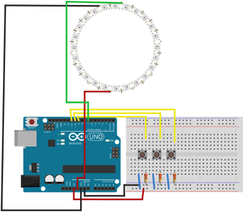

# Setup

To use the roulette tabel you have to connect it as follows:

(note, there isn't a fritzing model for our 45 leds Neopixel Ring, so i used the 24 leds version for this image, just connect the data pin to D7.)

